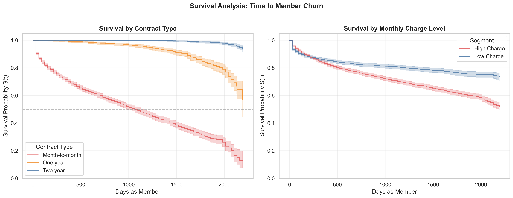

# Member Churn Risk Modeling
### Predicting Member Disengagement in Service Populations

[](https://www.python.org/)
[](https://scikit-learn.org/)
[](https://lightgbm.readthedocs.io/)
[](https://catboost.ai/)
[](https://lifelines.readthedocs.io/)

---

## Overview

In member-centered organizations — health insurance, preventive care memberships, subscription services — early cancellation is not just a revenue loss: it represents a break in continuity of care or service.

This project builds an end-to-end **member churn risk classification system** that goes beyond a standard classification pipeline. It combines predictive modeling with survival analysis to answer two distinct questions:

- **Who** is at risk of churning? → Classification (CatBoost, F1: 0.74, AUC-ROC: 0.92)
- **When** is the critical intervention window? → Survival Analysis (Kaplan-Meier + Log-Rank Test)

The methodology is directly transferable to health membership populations: predicting patient disengagement, stratifying cohorts by dropout risk, and informing proactive clinical routing.

---

## Survival Analysis: When Does Churn Happen?



The Kaplan-Meier curves reveal the **temporal structure of churn risk** — something a classification model alone cannot show.

**Left panel — by contract type:** Month-to-month members show a sharp survival drop in the first 200 days. Two-year contract members maintain near-flat survival throughout the observation period. A log-rank test confirms these differences are statistically significant (p < 0.05).

**Right panel — by charge level:** High-charge members disengage faster and at higher rates across the entire timeline — not just at a single threshold — suggesting price-value sensitivity is a persistent, not episodic, risk factor.

**Operational implication:** The first 200 days of a month-to-month membership is the highest-value intervention window. A proactive outreach during that period — validating perceived value, offering plan adjustment — has the greatest potential to shift the retention trajectory.

---

## Modeling Results

| Model | Accuracy | AUC-ROC | F1-Score |
|---|---|---|---|
| Dummy Classifier (baseline) | 0.7348 | 0.5000 | 0.0000 |
| Logistic Regression | 0.7967 | 0.8428 | 0.5728 |
| Random Forest (tuned) | 0.7853 | 0.8578 | 0.6447 |
| LightGBM (tuned) | 0.8296 | 0.9008 | 0.7126 |
| **CatBoost (final model)** | **0.8660** | **0.9160** | **0.7424** |


**CatBoost** is the best-performing model: highest values across all three metrics and the lowest train/test gap, indicating strong generalization. Threshold optimization was applied to maximize F1 given the asymmetric cost of missing a true churn event (false negative cost > false positive cost).

---

## Key Findings

**1. Commitment duration is the strongest churn predictor.** Tenure and contract type dominate permutation feature importance. In health terms: membership age and plan type are the primary moderators of disengagement risk.

**2. Churn risk concentrates in the first 200 days.** Kaplan-Meier curves show month-to-month members drop sharply in the early relationship phase — confirmed statistically significant by log-rank test. This defines the highest-value intervention window.

**3. Monthly charge level is the second most important predictor.** Members in higher charge brackets churn at disproportionately higher rates — with direct implications for pricing strategy and plan design.

**4. Oversampling did not improve LightGBM performance.** The `is_unbalance=True` parameter proved more effective than explicit rebalancing, suggesting the class imbalance (~26% churn) was not severe enough to warrant oversampling.

---

## Project Structure

```
member-churn-risk-model/
│
├── member_churn_risk_model.ipynb   # Main notebook (end-to-end pipeline)
├── survival_curves.png             # Kaplan-Meier plots (generated by notebook)
├── Datasets/
│   ├── contract.csv                # Contract type and billing data
│   ├── personal.csv                # Member demographics
│   ├── internet.csv                # Internet service features
│   └── phone.csv                   # Phone service features
└── README.md
```

---

## Methodology

```
Data Integration (4 sources)
    → EDA (churn patterns by contract, charges, demographics, services)
        → Survival Analysis (Kaplan-Meier curves + Log-Rank Test)
            → Feature Engineering (one-hot encoding + correlation analysis)
                → Modeling (5 models, GridSearchCV, threshold optimization)
                    → Permutation Feature Importance (CatBoost)
```

**Imbalance handling:** `class_weight='balanced'` and `is_unbalance=True` evaluated; no oversampling needed.

**Validation:** Stratified train/test split (75/25). Overfitting checked via train vs. test metric gap on all models.

**Threshold tuning:** Decision threshold optimized post-training to maximize F1 given the asymmetric cost of missing a true churn event.

---

## Stack

| Category | Tools |
|---|---|
| Data | Pandas, NumPy |
| Visualization | Matplotlib, Seaborn |
| Survival Analysis | lifelines (KaplanMeierFitter, logrank_test) |
| ML Models | Scikit-learn, LightGBM, CatBoost |
| Explainability | Permutation Importance (sklearn) |
| Environment | Jupyter Notebook |

---

## How to Run

**1. Clone the repo**
```bash
git clone https://github.com/csv-seb/member-churn-risk-model.git
cd member-churn-risk-model
```

**2. Install dependencies**
```bash
pip install pandas numpy matplotlib seaborn scikit-learn lightgbm catboost lifelines jupyter
```

**3. Launch the notebook**
```bash
jupyter notebook member_churn_risk_model.ipynb
```

Data loads automatically from the `/Datasets` folder via relative paths. No manual downloads required.

---

## Limitations

- Dataset is a practice/synthetic telecom dataset, not a clinical population. Results are methodologically valid but not directly generalizable to health data without external validation.
- A natural next step is a **Cox proportional hazards model** to estimate covariate-adjusted hazard ratios — extending the survival analysis from descriptive to inferential.
- A production deployment would require **drift detection** on the feature distribution and periodic model retraining as member behavior evolves over time.

---

## Author

**Sebastián Méndez Ramírez** 
